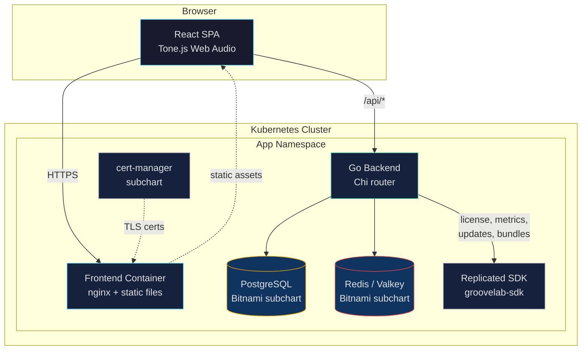
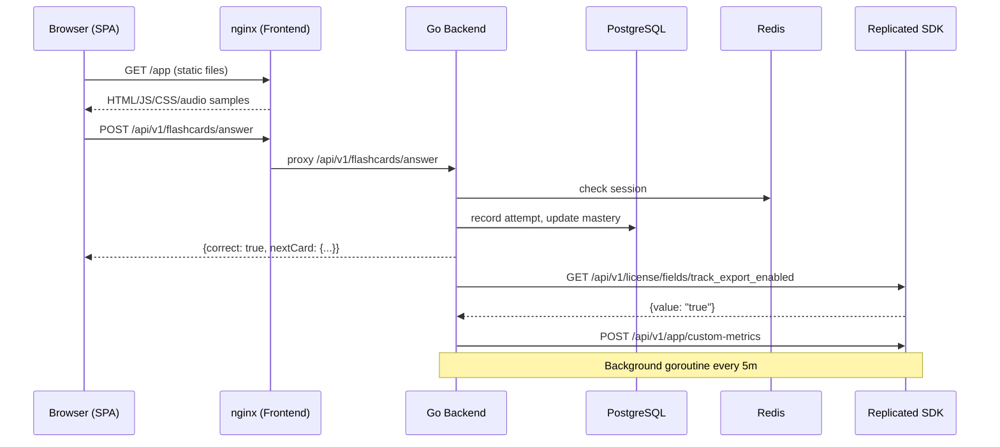
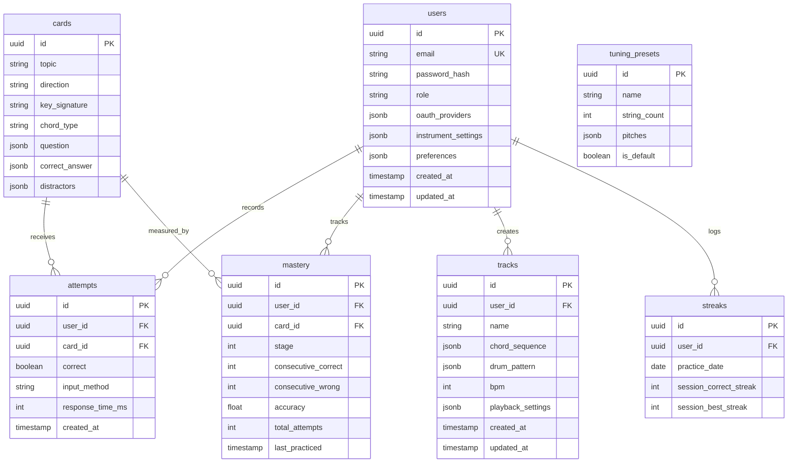

# ARCHITECTURE.md -- Groovelab

## System Overview

Groovelab is a browser-based music theory learning and practice application for bass guitar, distributed as a Kubernetes-native application via the Replicated platform. The system follows a two-container architecture: a React single-page application served by a lightweight static file server, and a Go REST API backend. Persistent state lives in PostgreSQL; transient session and cache data lives in Redis/Valkey.

The architecture is designed to satisfy the full Replicated Bootcamp rubric (Tiers 0-7) while delivering a genuinely useful music learning tool. Every architectural decision below serves at least one of: the end user's learning experience, the operator's deployment experience, or the bootcamp evaluator's rubric checklist.

### Architecture Principles

1. **Offline-first core**: All music theory content, audio synthesis, and flashcard logic run entirely in the browser. Network connectivity unlocks distribution concerns (license checks, updates, support bundles), not learning.
2. **Vertical slices over horizontal layers**: Each feature (flashcards, track builder, fretboard reference) is a full-stack slice from UI to database. No feature can be built in isolation without its integration story.
3. **Explicit integration points**: Every boundary between components has a defined contract (API endpoint, SDK URL, Helm value). No implicit coupling.
4. **Fail closed on security, fail open on availability**: License checks fail closed (no entitlement = locked feature). SDK unavailability fails open (app continues to function with cached state).
5. **Configuration over convention for operators**: BYO database, configurable service types, optional ingress. The operator controls the deployment shape; the chart provides sensible defaults.
6. **Air-gap as a first-class deployment target**: Every image is proxied, every feature degrades gracefully without network, and the Embedded Cluster path works fully offline.

### Architecture Diagram



---

## Technology Stack

### Frontend

| Technology | Version | Rationale |
|-----------|---------|-----------|
| **React** | 19.x | Component model maps naturally to Groovelab's UI: flashcards, step sequencer grid, fretboard, and admin panel are all discrete, stateful components. Largest ecosystem for accessible UI libraries. |
| **TypeScript** | 5.x | Type safety across the music theory domain model (notes, chords, scales, tunings) prevents a class of bugs that would otherwise surface as wrong notes or broken fretboard logic. |
| **Vite** | 6.x | Fast dev server with HMR. Produces optimized static bundles for the nginx container. No server-side rendering needed -- this is a pure SPA. |
| **Tone.js** | 15.x | Wraps the Web Audio API with musical abstractions (Transport, Synth, Sampler, Sequence). Handles audio context lifecycle, scheduling, and cross-browser quirks. Proven in browser-based music apps. |
| **React Router** | 7.x | Client-side routing for the SPA. Handles the Learn/Play/Fretboard/Admin navigation structure. |
| **Tailwind CSS** | 4.x | Utility-first CSS with dark mode support via `dark:` variants. Matches the design system's token-based approach. No runtime CSS-in-JS overhead that could interfere with audio scheduling. |

**Alternatives considered:**
- **Vue/Svelte**: Both viable, but React's ecosystem breadth (accessible component libraries, music visualization libraries, admin panel component kits) gives it an edge for this project's scope.
- **Next.js/Remix**: SSR adds deployment complexity (Node.js runtime in the container) with no benefit -- Groovelab is a pure client-side app with a separate API backend.
- **Webpack**: Slower dev experience than Vite. No compelling reason to choose it for a new project.

### Backend

| Technology | Version | Rationale |
|-----------|---------|-----------|
| **Go** | 1.24.x | User's preferred language. Strong stdlib for HTTP, excellent concurrency model for background tasks (metrics reporting, license polling). Single binary deployment. |
| **Chi** | 5.x | Lightweight, idiomatic Go HTTP router built on `net/http`. Composable middleware (auth, CORS, logging, rate limiting). No framework magic -- just a router with middleware. Compatible with the stdlib `http.Handler` interface, so Replicated SDK proxy handlers are trivial to wire. |
| **sqlc** | 2.x | Generates type-safe Go code from SQL queries. Write SQL, get Go structs and methods. No ORM abstraction leaks. Queries are auditable. Migrations are plain SQL files managed by `goose`. |
| **pgx** | 5.x | PostgreSQL driver used by sqlc-generated code. Connection pooling, LISTEN/NOTIFY support, prepared statement caching. The standard choice for Go + PostgreSQL. |
| **goose** | 3.x | SQL migration tool. Plain `.sql` files, no Go code for migrations. Runs as an init container or CLI command. Idempotent. |
| **go-redis** | 9.x | Official Redis client for Go. Used for session storage and caching. Supports Redis and Valkey (wire-compatible). |
| **Authboss** | 3.x | Modular authentication library for Go. Supports local accounts (email/password), OAuth2 (Google, GitHub), remember-me tokens, password recovery, and 2FA. Framework-agnostic -- integrates with Chi via middleware. |

**Alternatives considered:**
- **Gin/Echo**: Both add a custom `Context` type that wraps `http.Request`, which creates friction when integrating with stdlib-compatible libraries. Chi stays closer to the stdlib.
- **GORM**: ORM that generates SQL at runtime. Harder to audit queries, performance surprises with N+1 patterns. sqlc's compile-time approach is more predictable.
- **Goth**: OAuth-only -- no local accounts. Groovelab needs both local and OAuth auth. Authboss provides both in one library with a modular design.
- **Custom auth**: Rolling custom auth for local accounts + OAuth + session management + password recovery is error-prone. Authboss is maintained, battle-tested, and covers the full auth lifecycle.

### Infrastructure

| Technology | Purpose | Rationale |
|-----------|---------|-----------|
| **PostgreSQL 16** (Bitnami subchart) | Primary data store | User accounts, learning progress, saved tracks, adaptive mastery state. Embedded by default, BYO opt-in via Helm values. |
| **Redis 7 / Valkey 8** (Bitnami subchart) | Session store + cache | HTTP session data (Authboss session backend), entitlement cache, update-check cache. Avoids DB round-trips for hot-path reads. |
| **cert-manager** (subchart) | TLS certificate lifecycle | Auto-provisions certs (Let's Encrypt or self-signed CA). Satisfies the bootcamp requirement for three cert options: auto-provisioned, manually uploaded, self-signed. |
| **Replicated SDK** (subchart) | Distribution platform integration | License enforcement, custom metrics, update detection, support bundle upload. Deployed as `groovelab-sdk`. |
| **nginx** (in frontend container) | Static file server | Serves the Vite-built SPA. Handles SPA fallback routing (all paths serve `index.html`). Lightweight, production-hardened. |

---

## Component Topology

### Frontend Container (`groovelab-frontend`)

- **Base image**: `nginx:alpine` (multi-stage build; Vite build stage produces static files, nginx stage serves them)
- **Serves**: The React SPA as static HTML/JS/CSS/assets
- **SPA routing**: nginx config rewrites all non-file requests to `index.html`
- **API proxy**: nginx proxies `/api/*` to the backend service (avoids CORS configuration)
- **Health probe**: nginx returns 200 on `/` for liveness; readiness checks that `index.html` is present
- **Audio samples**: Drum rack samples are bundled into the static build output (see Risk Items section)

### Backend Container (`groovelab-backend`)

- **Binary**: Single Go binary compiled with `CGO_ENABLED=0`
- **Port**: 8080 (HTTP)
- **Endpoints**: REST API under `/api/v1/*`, health at `/healthz`, metrics proxy at `/api/replicated/*`
- **Init container**: `wait-for-db` checks PostgreSQL readiness via `pg_isready` before the main container starts
- **Migration**: `goose` runs as a second init container after `wait-for-db`, applying pending migrations
- **Background goroutines**: License validity polling (every 60s), custom metrics reporting (every 5m), update check (every 15m)

### Data Flow



---

## API Design

### Principles

- **REST over GraphQL**: The resource model is straightforward (users, cards, attempts, tracks, settings). REST is simpler to cache, easier to debug, and aligns with the Replicated SDK's own REST API.
- **Versioned**: All app endpoints live under `/api/v1/`. Version bump only on breaking changes.
- **JSON request/response**: `Content-Type: application/json` throughout.
- **Auth via session cookie**: Authboss manages session cookies stored in Redis. No JWT -- sessions are revocable and server-controlled.
- **Replicated proxy endpoints**: The backend proxies SDK calls under `/api/replicated/*` to avoid exposing the SDK service directly to the browser.

### Endpoint Groups

| Group | Prefix | Description |
|-------|--------|-------------|
| Auth | `/api/v1/auth/*` | Login, logout, register, OAuth callbacks, password recovery (Authboss routes) |
| Flashcards | `/api/v1/flashcards/*` | Card pool, submit answer, session state |
| Progress | `/api/v1/progress/*` | Mastery dashboard, accuracy stats, streaks |
| Tracks | `/api/v1/tracks/*` | CRUD for saved practice tracks |
| Fretboard | `/api/v1/fretboard/*` | Tuning presets, user instrument settings |
| Settings | `/api/v1/settings/*` | User preferences (theme, instrument, tuning) |
| Admin | `/api/v1/admin/*` | User management, track moderation (admin role required) |
| Replicated | `/api/replicated/*` | Proxy to SDK: license info, updates, support bundle, entitlements |
| Health | `/healthz` | Structured health check (not versioned) |

### Health Endpoint Design

`GET /healthz` returns a structured JSON response checked by Kubernetes probes, the support bundle HTTP collector, and the admin panel.

```json
{
  "status": "ok",
  "version": "1.0.0",
  "checks": {
    "database": { "status": "ok", "latency_ms": 2 },
    "redis": { "status": "ok", "latency_ms": 1 },
    "license": { "status": "ok", "valid": true, "expires": "2027-01-01T00:00:00Z" }
  }
}
```

- **Liveness probe**: `GET /healthz` -- returns 200 if the Go process is running (does not check dependencies).
- **Readiness probe**: `GET /healthz` -- returns 200 only if `database.status == "ok"` and `redis.status == "ok"`. License check failure does not block readiness (fail open).
- **Support bundle textAnalyze**: Matches `"status":\s*"ok"` in the top-level response.

---

## Authentication Architecture

### Library: Authboss

Authboss provides a modular authentication system with the following modules enabled for Groovelab:

| Module | Purpose |
|--------|---------|
| `auth` | Local email/password login |
| `register` | Account creation with email/password |
| `oauth2` | Google and GitHub OAuth login |
| `remember` | Persistent login via remember-me cookie |
| `recover` | Password recovery via email (requires SMTP -- offline installs use local accounts only) |
| `logout` | Session destruction |

### Session Management

- Sessions are stored in Redis/Valkey via `go-redis`.
- Session cookie: `HttpOnly`, `Secure` (when TLS is active), `SameSite=Lax`.
- Session TTL: 24 hours (configurable via Helm values).
- Remember-me token TTL: 30 days.

### OAuth Configuration

OAuth client IDs and secrets are provided via Helm values (or KOTS config screen) and injected as environment variables:

```yaml
auth:
  oauth:
    google:
      enabled: false
      clientID: ""
      clientSecret: ""
    github:
      enabled: false
      clientID: ""
      clientSecret: ""
```

OAuth is disabled by default. In air-gap environments, only local accounts are available. The frontend detects the absence of connectivity and renders OAuth buttons in a **disabled state with an explanatory tooltip**: "OAuth sign-in requires network connectivity. Use a local account." The buttons remain visible (not hidden) so the user understands the capability exists but is unavailable in the current environment.

### Role Model

| Role | Capabilities |
|------|-------------|
| `guest` | All core features (flashcards, fretboard, track builder). No persistence. Cannot save tracks or export. |
| `user` | Core features + save progress, save tracks, user settings. Track export requires the `track_export_enabled` license entitlement (see dual-gate note below). |
| `admin` | User capabilities + admin panel (user management, track moderation, updates, license, support bundles). |

The first registered user is automatically assigned the `admin` role. Subsequent users are `user` by default. Admins can promote/demote via the admin panel.

**Track export dual-gate**: Exporting a practice track requires **both** conditions to be true: (1) the user is authenticated (role = `user` or `admin`, not `guest`), and (2) the `track_export_enabled` license entitlement is set to `"true"`. Guests cannot save tracks, so export is meaningless without a saved track. The backend enforces both checks -- session authentication middleware runs first (returning 401 for unauthenticated requests), then the entitlement check runs (returning 403 if the license field is not enabled). The frontend reflects both gates: guests see no export option; authenticated users see the export button in either its unlocked or locked state depending on the license entitlement.

---

## Data Architecture

### PostgreSQL Schema (High-Level)



### Key Schema Decisions

- **`cards` table is seeded, not user-generated**: Card content (chord types, scales, keys) is loaded via database seed migration. Adding new content is a migration, not a runtime operation. This aligns with the design principle that content is data.
- **`mastery` is per-user, per-card**: Each card+user pair has an independent mastery stage and accuracy tracker. The adaptive algorithm queries this table to select the next card.
- **`attempts` is append-only**: Every answer is recorded for analytics. The mastery table is a materialized view of attempt history.
- **JSONB for flexible structures**: Chord sequences, drum patterns, and instrument settings use JSONB columns. These structures are complex and evolving -- JSONB avoids migration churn during early development.
- **`tuning_presets` table**: Standard tunings (EADG, BEADG, BEADGC, Drop D, etc.) are seeded. Users can create custom tunings stored in their `instrument_settings` JSONB field.

### Redis/Valkey Data Model

| Key Pattern | TTL | Purpose |
|------------|-----|---------|
| `session:<token>` | 24h | Authboss session data |
| `remember:<token>` | 30d | Remember-me tokens |
| `license:info` | 5m | Cached license validity from SDK |
| `license:field:<name>` | 5m | Cached entitlement field values |
| `update:available` | 15m | Cached update check result |

Redis is a cache and session store, not a primary data store. All data in Redis is reconstructible from PostgreSQL or the SDK.

---

## Helm Chart Structure

### Directory Layout

```
chart/
  Chart.yaml
  values.yaml
  values.schema.json
  .helmignore
  templates/
    _helpers.tpl
    NOTES.txt
    frontend/
      deployment.yaml
      service.yaml
      configmap.yaml          # nginx.conf
    backend/
      deployment.yaml
      service.yaml
      configmap.yaml          # app config
      secret.yaml             # DB credentials, OAuth secrets, session key
    init/
      wait-for-db.yaml        # init container template
    ingress.yaml              # optional, off by default
    networkpolicy.yaml        # for air-gap validation
    support-bundle.yaml
    preflight.yaml
    kots-config.yaml
    helmchart.yaml            # HelmChart CR for KOTS
    replicated-app.yaml       # Application CR
  charts/                     # subchart tarballs (helm dependency update)
```

### Chart.yaml Dependencies

```yaml
apiVersion: v2
name: groovelab
description: Browser-based music theory learning and practice application
version: 0.1.0
appVersion: "0.1.0"

dependencies:
  - name: postgresql
    version: "16.x.x"
    repository: oci://registry-1.docker.io/bitnamicharts
    condition: postgresql.enabled

  - name: redis
    version: "20.x.x"
    repository: oci://registry-1.docker.io/bitnamicharts
    condition: redis.enabled
    alias: redis

  - name: cert-manager
    version: "1.x.x"
    repository: https://charts.jetstack.io
    condition: cert-manager.enabled

  - name: replicated
    version: "1.x.x"
    repository: oci://registry.replicated.com/library
    condition: replicated.enabled
```

### BYO Database Toggle Pattern

The embedded PostgreSQL subchart is enabled by default. Operators can disable it and provide external database credentials.

**values.yaml:**

```yaml
postgresql:
  enabled: true                # set to false for BYO
  auth:
    database: groovelab
    username: groovelab
    # password generated via Helm lookup on first install

externalDatabase:
  host: ""
  port: 5432
  database: groovelab
  username: groovelab
  password: ""
  existingSecret: ""           # alternative to inline password
  sslMode: "require"
```

**Template logic (backend deployment):**

```yaml
env:
  - name: DATABASE_HOST
    value: {{ if .Values.postgresql.enabled }}
             {{ include "groovelab.postgresql.fullname" . }}
           {{ else }}
             {{ required "externalDatabase.host is required when postgresql.enabled=false" .Values.externalDatabase.host }}
           {{ end }}
```

**Secret generation (Helm lookup pattern):**

```yaml
{{- $existing := lookup "v1" "Secret" .Release.Namespace (printf "%s-db-credentials" (include "groovelab.fullname" .)) }}
data:
  {{- if $existing }}
  password: {{ index $existing.data "password" }}
  {{- else }}
  password: {{ randAlphaNum 32 | b64enc | quote }}
  {{- end }}
```

This ensures the generated password survives upgrades (Tier 5 requirement).

### Replicated SDK Subchart Branding

```yaml
replicated:
  enabled: true
  fullnameOverride: "groovelab-sdk"
```

Verification: `kubectl get deployment groovelab-sdk` shows the branded SDK deployment.

### Optional Ingress

```yaml
ingress:
  enabled: false               # off by default (Tier 2 requirement)
  className: ""
  annotations: {}
  hosts:
    - host: groovelab.example.com
      paths:
        - path: /
          pathType: Prefix
  tls: []
```

### Configurable Service Type

```yaml
service:
  type: ClusterIP              # ClusterIP | NodePort | LoadBalancer
  port: 443
  nodePort: ""                 # only when type=NodePort
```

### values.schema.json

Required by Tier 0. Validates all user-facing values:

- `postgresql.enabled` (boolean)
- `externalDatabase.*` (conditional required fields)
- `service.type` (enum: ClusterIP, NodePort, LoadBalancer)
- `ingress.enabled` (boolean)
- `auth.oauth.google.clientID` (string, optional)
- `replicated.enabled` (boolean)

The schema enforces that `externalDatabase.host` is required when `postgresql.enabled` is false.

---

## KOTS Config Screen (Tier 5)

The config screen provides at least 3 meaningful capabilities wired through Helm values. All items have `help_text`. At least one item uses regex validation.

### Config Items

| Item | Type | Capability | Tier 5 Requirement |
|------|------|-----------|-------------------|
| **Database Type** | `select_one` (Embedded / External) | BYO DB toggle; selecting External reveals host, port, username, password, SSL mode fields | External stateful component toggle with conditional fields |
| **External DB Host** | `text` (conditional) | Regex-validated hostname/IP | Regex validation |
| **External DB Password** | `password` (conditional, generated default) | Auto-generated on first install, survives upgrade | Generated defaults survive upgrade |
| **Session Duration** | `text` (regex: `^\d+[hm]$`) | Configurable session timeout (e.g., `24h`, `120m`) | Configurable app feature 1 |
| **Max Cards Per Session** | `text` (regex: `^\d+$`) | Number of flashcards per learning session (default: 20) | Configurable app feature 2 |
| **Enable Guest Access** | `bool` | Toggle whether unauthenticated users can use the app | Configurable app feature 3 (optional extra) |
| **Track Export** | `bool` (gated by `LicenseFieldValue`) | Export practice tracks -- controlled by license entitlement on EC path | License-gated configurable feature (Tier 4) |

### LicenseFieldValue Wiring (Tier 4)

In `helmchart.yaml`, the track export config item visibility is controlled by the license:

```yaml
spec:
  values:
    features:
      trackExport:
        enabled: '{{repl LicenseFieldValue "track_export_enabled" }}'
```

When the license field `track_export_enabled` is false, the config item is hidden/locked in the KOTS admin console, and the feature is unavailable in the app.

### Four-Way Contract

| Artifact | File | Role |
|----------|------|------|
| Chart defaults | `values.yaml` | Schema and defaults Helm expects |
| KOTS UI | `kots-config.yaml` | Admin Console field definitions, conditionals, help text, validation |
| KOTS mapping | `helmchart.yaml` | Maps config options to Helm values via template functions |
| Dev/CI testing | `dev-values.yaml` | Mirrors KOTS config for headless testing without Admin Console |

---

## Replicated SDK Integration

### License Enforcement (Tier 2)

The Go backend queries the SDK at runtime to enforce license validity and feature entitlements. This is an active check, not a passive display.

**License validity**: A background goroutine polls `GET http://groovelab-sdk:3000/api/v1/license/info` every 60 seconds. Results are cached in Redis with a 5-minute TTL. If the license is expired or invalid, the backend returns `403 Forbidden` with a structured error for all authenticated API calls. The frontend renders a license expiration banner.

**Feature entitlement (track export)**: The backend queries `GET http://groovelab-sdk:3000/api/v1/license/fields/track_export_enabled` when the user attempts to export a track. The result is cached in Redis for 5 minutes. If the field value is not `"true"`, the API returns `403` and the frontend shows the lock icon + tooltip pattern defined in DESIGN.md. Note: this entitlement check is the second gate -- the request must first pass authentication middleware (only `user` and `admin` roles can reach the export endpoint; guests receive `401 Unauthorized`). See the Role Model section for the full dual-gate description.

**Demo flow**: Install with `track_export_enabled: false` -> show the locked export button in the UI -> update the license field in Vendor Portal -> within 5 minutes, the export button unlocks without redeployment.

### Custom Metrics (Tier 2)

A background goroutine in the Go backend posts metrics to the SDK every 5 minutes:

```
POST http://groovelab-sdk:3000/api/v1/app/custom-metrics

{
  "data": {
    "active_users_24h": 12,
    "flashcard_attempts_24h": 340,
    "tracks_created_total": 8,
    "mastery_completion_pct": 42.5
  }
}
```

These metrics appear on the Vendor Portal Instance Details page.

### Update Available Banner (Tier 2)

The backend polls `GET http://groovelab-sdk:3000/api/v1/app/updates` every 15 minutes and caches the result in Redis. The frontend fetches `GET /api/replicated/updates` on page load. If updates are available, a dismissible banner appears at the top of every page (as defined in DESIGN.md).

- **Admin users**: "A new version of Groovelab is available. [View in Admin]"
- **Non-admin users**: "A new version is available. Contact your administrator."
- **Apply Update button (admin panel)**: On the EC/KOTS path, triggers the Replicated update flow. On the Helm path, displays `helm upgrade` instructions.

### Support Bundle Upload (Tier 3)

The admin panel's Support section triggers bundle collection and upload:

1. Frontend calls `POST /api/replicated/support-bundle`
2. Backend proxies to `POST http://groovelab-sdk:3000/api/v1/troubleshoot/supportbundle`
3. SDK collects the bundle using the `SupportBundle` spec in the chart and uploads to Vendor Portal
4. Backend returns the bundle ID to the frontend
5. A "Download locally" option is always available (for air-gap environments where upload fails)

---

## Preflight Checks (Tier 3)

All 5 required preflight checks are implemented in `preflight.yaml`:

| Check | Trigger Condition | Pass | Fail |
|-------|------------------|------|------|
| **External DB connectivity** | Only when `postgresql.enabled=false` | `pg_isready` succeeds against configured host:port | Actionable message naming the host and port, with troubleshooting steps |
| **External endpoint** | Always (checks Replicated API reachability; conditional for OAuth providers if enabled) | TCP connect to `replicated.app:443` succeeds | "Cannot reach Replicated API. Verify outbound HTTPS access." |
| **Cluster resources** | Always | 4+ CPU cores allocatable, 8+ GiB memory | Names the shortfall and recommends node scaling |
| **Kubernetes version** | Always | >= 1.28.0 | Names the minimum version and links to upgrade docs |
| **Distribution blocklist** | Always | Not docker-desktop or microk8s | Names the unsupported distribution and lists supported alternatives |

---

## Support Bundle Spec (Tier 3)

Defined in `support-bundle.yaml`:

### Collectors

| Collector | Selector / Target | Limits |
|-----------|-------------------|--------|
| Frontend logs | `app.kubernetes.io/component=frontend` | maxLines: 5000, maxAge: 72h |
| Backend logs | `app.kubernetes.io/component=backend` | maxLines: 10000, maxAge: 72h |
| PostgreSQL logs | `app.kubernetes.io/name=postgresql` | maxLines: 5000, maxAge: 48h |
| Redis logs | `app.kubernetes.io/name=redis` | maxLines: 5000, maxAge: 48h |
| SDK logs | `app.kubernetes.io/name=replicated` | maxLines: 5000, maxAge: 48h |
| Health endpoint | HTTP GET `http://groovelab-backend.<namespace>.svc.cluster.local:8080/healthz` | -- |

### Analyzers

| Analyzer | Type | What It Checks |
|----------|------|---------------|
| App health | `textAnalyze` | Matches `"status":\s*"ok"` in health endpoint response |
| Frontend deployment | `deploymentStatus` | Frontend has >= 1 available replica |
| Backend deployment | `deploymentStatus` | Backend has >= 1 available replica |
| PostgreSQL StatefulSet | `statefulsetStatus` | PostgreSQL has >= 1 ready replica (when embedded) |
| Redis deployment | `deploymentStatus` | Redis has >= 1 available replica |
| DB connection exhaustion | `textAnalyze` | Regex: `too many clients already\|connection pool exhausted\|FATAL.*max_connections` in backend logs |
| Default storage class | `storageClass` | At least one default storage class exists |
| Node readiness | `nodeResources` | All nodes in Ready state |

---

## Image Build Strategy

### Dockerfiles

**Frontend (`frontend/Dockerfile`):**

```dockerfile
# Stage 1: Build
FROM node:22-alpine AS build
WORKDIR /app
COPY package.json package-lock.json ./
RUN npm ci
COPY . .
RUN npm run build

# Stage 2: Serve
FROM nginx:1.27-alpine
COPY --from=build /app/dist /usr/share/nginx/html
COPY nginx.conf /etc/nginx/conf.d/default.conf
EXPOSE 8080
```

**Backend (`backend/Dockerfile`):**

```dockerfile
# Stage 1: Build
FROM golang:1.24-alpine AS build
WORKDIR /app
COPY go.mod go.sum ./
RUN go mod download
COPY . .
RUN CGO_ENABLED=0 GOOS=linux go build -o /groovelab ./cmd/server

# Stage 2: Run
FROM gcr.io/distroless/static-debian12:nonroot
COPY --from=build /groovelab /groovelab
COPY --from=build /app/migrations /migrations
EXPOSE 8080
ENTRYPOINT ["/groovelab"]
```

### Image Registry and Proxy

- **Primary registry**: GHCR (`ghcr.io/adamancini/groovelab-frontend`, `ghcr.io/adamancini/groovelab-backend`)
- **Replicated proxy**: All images referenced in the Helm chart use `proxy.xyyzx.net/adamancini/groovelab-frontend` (and `-backend`). The proxy rewrites to the configured registry at install time.
- **Air-gap**: Images are bundled into the Replicated release. The local registry rewrite handles image references automatically.

### Image Signing

Cosign signs images in CI after push to GHCR:

```bash
cosign sign --yes ghcr.io/adamancini/groovelab-frontend:${TAG}
cosign sign --yes ghcr.io/adamancini/groovelab-backend:${TAG}
```

Verification:

```bash
cosign verify ghcr.io/adamancini/groovelab-frontend:${TAG} \
  --certificate-identity-regexp=".*" \
  --certificate-oidc-issuer="https://token.actions.githubusercontent.com"
```

---

## CI/CD Pipeline (Tier 1)

### PR Workflow (`.github/workflows/pr.yaml`)

Triggered on pull requests to `main`:

1. **Lint and test**: `helm lint`, `go test ./...`, `npm run lint && npm run test`
2. **Build images**: Multi-stage Docker builds for frontend and backend
3. **Push to GHCR**: Tagged with `pr-<number>-<sha>`
4. **Sign images**: Cosign keyless signing via GitHub Actions OIDC
5. **Create Replicated release**: `replicated release create --yaml-dir chart/ --promote PR-<number>` (creates a temporary channel)
6. **Test on CMX**: `replicated cluster create --distribution k3s --version 1.30` -> install -> verify health -> tear down

### Release Workflow (`.github/workflows/release.yaml`)

Triggered on merge to `main`:

1. **Build images**: Tagged with `v<semver>` (from git tag or commit-based version)
2. **Push to GHCR**: Production tag
3. **Sign images**: Cosign
4. **Create Replicated release**: `replicated release create --yaml-dir chart/ --promote Unstable`
5. **Test on CMX**: Full install + upgrade test on CMX
6. **Promote to Stable**: Manual trigger (or automated after CMX passes) with email notification

### Replicated RBAC Policy (Tier 1)

A scoped RBAC policy for the CI service account limits permissions:

```json
{
  "v1": {
    "name": "CI Service Account",
    "resources": {
      "allowed": [
        "kots/app/[:appId]/release/**",
        "kots/app/[:appId]/channel/**",
        "platform/app/[:appId]/cluster/**"
      ],
      "denied": [
        "kots/app/[:appId]/license/**",
        "platform/app/[:appId]/customer/**"
      ]
    }
  }
}
```

The CI account can create releases, manage channels, and spin up CMX clusters. It cannot manage licenses or customers.

### Email Notification (Tier 1)

Configured in Vendor Portal: email notification triggers when a release is promoted to the Stable channel. Sends to the configured `@replicated.com` address.

### Vendor Portal Notifications (Tier 7 -- SC-10)

Tier 7 requires demonstrating **both** email and webhook notification channels, configured in the Vendor Portal's notification settings. This is distinct from the Tier 1 Stable-promote email above.

**Email notifications**: A custom email sender is configured in the Vendor Portal with a verified domain (SPF/DKIM) for deliverability. Event triggers include release promotions, license expirations, and instance status changes. The custom sender domain is also required by the Enterprise Portal (Tier 6).

**Webhook notifications**: A webhook URL is registered in the Vendor Portal notification settings. Events are posted as JSON payloads to the configured endpoint. At minimum, the webhook fires on release promotion events and instance status changes.

**Demonstration**: Both channels must be shown functioning during evaluation -- the email notification delivers to the configured address, and the webhook endpoint receives the event payload. These are Vendor Portal configuration items, not application code; the architecture's responsibility is to document them as deliverables and ensure the CI/CD pipeline's release promotion triggers the configured notifications.

---

## Embedded Cluster v3 (Tier 4)

### Configuration

The Embedded Cluster config is defined in the `replicated-app.yaml` Application CR:

```yaml
apiVersion: kots.io/v1beta1
kind: Application
metadata:
  name: groovelab
spec:
  title: Groovelab
  icon: https://raw.githubusercontent.com/adamancini/groovelab/main/assets/icon.png
  statusInformers:
    - deployment/groovelab-frontend
    - deployment/groovelab-backend
    - statefulset/groovelab-postgresql
  ports:
    - serviceName: groovelab-frontend
      servicePort: 443
      localPort: 443
      applicationUrl: "https://groovelab.local"
```

### Install Paths

| Path | Command | Verification |
|------|---------|-------------|
| **Fresh install** | `sudo ./groovelab install --license license.yaml` | All pods Running; app opens in browser |
| **In-place upgrade** | Apply new release via KOTS admin console or CLI | Data survives; all pods Running at new version |
| **Air-gap install** | `sudo ./groovelab install --license license.yaml --airgap-bundle groovelab.airgap` | All pods Running; zero outbound network requests |

### Air-Gap Network Policy (Tier 7)

A `NetworkPolicy` in the chart blocks all egress when air-gap mode is detected:

```yaml
{{- if .Values.airgap.networkPolicy.enabled }}
apiVersion: networking.k8s.io/v1
kind: NetworkPolicy
metadata:
  name: {{ include "groovelab.fullname" . }}-airgap
spec:
  podSelector:
    matchLabels:
      app.kubernetes.io/part-of: groovelab
  policyTypes:
    - Egress
  egress:
    - to:
        - podSelector: {}          # allow intra-namespace
    - to:
        - namespaceSelector: {}    # allow to kube-system (DNS)
      ports:
        - protocol: UDP
          port: 53
        - protocol: TCP
          port: 53
{{- end }}
```

Validation: Run the app under CMX with network policy enabled, exercise all features, and produce a report showing zero outbound requests.

---

## Enterprise Portal v2 (Tier 6)

| Item | Implementation |
|------|---------------|
| **Branding** | Custom logo, favicon, title, and color scheme applied in portal settings |
| **Custom email sender** | Vendor domain email configured for deliverability (SPF, DKIM) |
| **Security center** | CVE vulnerabilities visible to customers; base images use distroless/Alpine for minimal CVE surface |
| **Custom setup docs** | GitHub App integrated; left nav and content customized for Groovelab installation |
| **Chart reference in toc.yaml** | Auto-generated Helm chart reference; at least 1 field intentionally undocumented |
| **Terraform modules** | Generated Terraform modules included; enabled/disabled by custom license field |
| **Self-serve sign-up** | Sign-up URL shared; customer record appears in Vendor Portal |
| **End-to-end install** | Both Helm and EC install paths documented and tested via portal |
| **Upgrade instructions** | Documented for both Helm (`helm upgrade`) and EC (admin console) paths |

---

## Init Container Pattern

The backend deployment uses two init containers in sequence:

```yaml
initContainers:
  # 1. Wait for database
  - name: wait-for-db
    image: busybox:latest
    command: ["sh", "-c"]
    args:
      - |
        until nc -zv $DB_HOST $DB_PORT; do
          echo "Waiting for database at $DB_HOST:$DB_PORT..."
          sleep 2
        done
        echo "Database is ready."
    env:
      - name: DB_HOST
        valueFrom: ...
      - name: DB_PORT
        valueFrom: ...

  # 2. Run migrations
  - name: db-migrate
    image: {{ .Values.backend.image.repository }}:{{ .Values.backend.image.tag }}
    command: ["/groovelab", "migrate"]
    env:
      - name: DATABASE_URL
        valueFrom: ...
```

The `wait-for-db` init container prevents crashlooping. The `db-migrate` init container runs goose migrations (idempotent, safe to run on every pod start).

---

## Offline / Air-Gap Behavior

| Feature | Online | Offline |
|---------|--------|---------|
| Flashcard drilling | Full | Full (all card data seeded in DB) |
| Fretboard reference | Full | Full (computed from tuning + theory logic) |
| Track builder + playback | Full | Full (Web Audio API + bundled samples) |
| Progress tracking | Full | Full (reads/writes local DB) |
| Local auth | Full | Full |
| OAuth auth | Full | Unavailable (buttons visible but disabled with tooltip: "OAuth sign-in requires network connectivity. Use a local account.") |
| License check | Live SDK query | Cached result from Redis; if never validated, warning in admin panel only |
| Update check | Live SDK query | Banner does not appear; admin shows "Unable to check -- no connectivity" |
| Support bundle | Generate + upload | Generate works; upload disabled with "Download locally" fallback |
| Custom metrics | Sent to Vendor Portal | Silently skipped (no data loss -- metrics are point-in-time) |

---

## Security Posture

### Image Security

- **Signed images**: Cosign keyless signing in CI using GitHub Actions OIDC identity (Tier 7)
- **CVE scanning**: Trivy or Grype scan in CI; block release on critical/high CVEs
- **Minimal base images**: `distroless/static-debian12:nonroot` for backend, `nginx:alpine` for frontend
- **Non-root execution**: Both containers run as non-root users

### Network Security

- **Air-gap network policy**: Blocks all egress except intra-namespace and DNS (Tier 7)
- **NetworkPolicy for DB isolation**: PostgreSQL accepts connections only from backend pods (configurable ingress controller namespace labels)
- **TLS everywhere**: cert-manager provisions certificates; three options supported (auto, manual upload, self-signed)

### Secret Management

- **Helm lookup for generated secrets**: DB password, session encryption key, and OAuth secrets use the lookup pattern to persist across upgrades
- **No secrets in values.yaml defaults**: All secret values default to empty strings; generated at install time or provided by operator
- **KOTS config screen passwords**: Masked input fields for sensitive values

### CVE Posture Discussion (Tier 7)

Base image choices minimize CVE surface:
- `distroless/static` has near-zero OS-level CVEs (no shell, no package manager)
- `nginx:alpine` has a small footprint; pinned to specific patch versions
- Go dependencies are scanned with `govulncheck` in CI
- npm dependencies are scanned with `npm audit` in CI
- Strategy: rebuild and promote a patch release when critical CVEs are reported

---

## Drum Rack Audio Sample Bundling -- RISK ITEM

**Status**: TBD. The user has not determined the size of drum rack audio samples.

**Current assumption**: Samples are bundled into the frontend container's static build output (`/usr/share/nginx/html/samples/`). They ship with every frontend image.

**Risk**: If samples are large (tens of MB), the frontend container image becomes bloated, increasing:
- Pull time (especially in air-gap where the entire image is in the bundle)
- CI build time
- Browser load time (though samples can be lazy-loaded)

**Mitigation options (to be evaluated when sample sizes are known)**:
1. **Synthesized samples only**: Use Tone.js synthesis for all drum sounds (zero sample files). Quality is lower but image stays small.
2. **Compressed formats**: Use OGG Vorbis or WebM instead of WAV. 90%+ size reduction.
3. **Lazy loading**: Load samples on demand when the user enters Play mode, not on initial page load.
4. **Separate sample container/volume**: Mount samples via a shared volume from a dedicated init container. Decouples sample updates from frontend releases.

**Decision**: Deferred until sample content is finalized. The architecture supports all four options. Start with option 2 (compressed formats bundled in the frontend image) and reassess if image size exceeds 100MB.

---

## Adaptive Learning Data Model

The adaptive algorithm uses the `mastery` and `attempts` tables to select cards and input methods:

### Card Selection Algorithm (Simplified)

```
1. Query mastery records for the user + selected topic
2. Partition into buckets:
   a. New cards (no mastery record): limited introduction rate (2-3 per session)
   b. Struggling cards (accuracy < 50% OR consecutive_wrong >= 2): high priority
   c. Due for review (last_practiced > threshold based on stage): medium priority
   d. Mastered (stage == Advanced AND accuracy > 90%): low priority / excluded
3. Build session queue:
   - 40% struggling cards (re-drill weak areas)
   - 30% due-for-review cards (spaced repetition maintenance)
   - 20% new cards (progressive disclosure)
   - 10% random from mastered (prevent decay)
4. Shuffle within each bucket to avoid predictable ordering
```

### Input Method Progression

| Stage | Name | Threshold to Advance | Threshold to Regress |
|-------|------|---------------------|---------------------|
| 0 | Multiple choice (4 options) | 3 consecutive correct | -- (cannot regress below 0) |
| 1 | Reduced choice (3 options) | 3 consecutive correct | 2 consecutive wrong |
| 2 | Typed answer | 3 consecutive correct | 2 consecutive wrong |
| 3 | Fretboard tap | -- (max stage) | 2 consecutive wrong |

Progression thresholds are configurable via the KOTS config screen (advanced section) or Helm values.

---

## Fretboard Data Model

### Tuning Presets (Seeded)

| Name | Strings | Pitches (low to high) |
|------|---------|----------------------|
| Standard 4 | 4 | E1, A1, D2, G2 |
| Drop D 4 | 4 | D1, A1, D2, G2 |
| Half-step Down 4 | 4 | Eb1, Ab1, Db2, Gb2 |
| Standard 5 | 5 | B0, E1, A1, D2, G2 |
| Drop A 5 | 5 | A0, E1, A1, D2, G2 |
| Standard 6 | 6 | B0, E1, A1, D2, G2, C3 |
| Half-step Down 6 | 6 | Bb0, Eb1, Ab1, Db2, Gb2, B2 |

Additional 6-string variants (e.g., Drop B: A#0, E1, A1, D2, G2, C3) are deferred to post-v1. The schema and UI support arbitrary tuning presets; these can be added as seed migrations without schema changes.

### String Configuration

Stored in the user's `instrument_settings` JSONB:

```json
{
  "stringCount": 4,
  "tuningPresetId": "uuid-of-standard-4",
  "customTuning": null,
  "fretRange": [0, 12]
}
```

When `customTuning` is non-null, it overrides the preset:

```json
{
  "customTuning": ["D1", "A1", "D2", "G2"]
}
```

The fretboard renderer, flashcard fretboard-tap input, and playback fretboard overlay all read from this configuration. Changing tuning in Settings updates all three views immediately.

---

## Non-Functional Requirements Mapping

| NFR (from BUSINESS.md) | Architecture Response |
|------------------------|----------------------|
| **Availability**: survive pod deletion without data loss | PostgreSQL PVC persists data; Redis is reconstructible; stateless frontend/backend pods |
| **Health observability**: `/healthz` endpoint | Structured JSON response with per-dependency status; used by K8s probes and support bundle analyzer |
| **Startup resilience**: no crashloop on DB unavailability | `wait-for-db` init container loops until PostgreSQL accepts connections |
| **HTTPS**: three cert options | cert-manager subchart (auto-provisioned + self-signed CA); manual cert upload via TLS secret; Ingress TLS termination |
| **Update awareness**: banner in UI | Backend polls SDK `/api/v1/app/updates`; frontend renders dismissible banner on all pages |
| **License enforcement**: active SDK check | Backend goroutine polls license info every 60s; cached in Redis; 403 on expired/invalid |
| **Supportability**: bundle from UI | Admin panel triggers SDK bundle collection + upload; local download fallback for air-gap |
| **Installability**: fresh, upgrade, air-gap | EC v3 config supports all three paths; tested in CMX CI |
| **Configurability**: 3+ capabilities in config screen | DB toggle, session duration, max cards per session, guest access, track export (license-gated) |
| **Security**: signed images, CVE review, air-gap network policy | Cosign signing, Trivy/Grype scanning, NetworkPolicy for zero outbound in air-gap |
| **Audio latency**: responsive playback | Web Audio API runs entirely in the browser; Tone.js handles scheduling; no server round-trips for audio |
| **Progress persistence**: survives restarts and upgrades | PostgreSQL PVC + Helm lookup for secret stability; goose migrations are additive |

---

## Decision Records

| Decision | Chosen | Rationale | Alternatives Considered |
|----------|--------|-----------|------------------------|
| Frontend framework | React + TypeScript + Vite | Largest ecosystem for accessible UI components and music visualization. Vite provides fast builds. TypeScript prevents bugs in the music theory domain model. | Vue (smaller ecosystem for music libs), Svelte (fewer accessible component libraries), Next.js (SSR not needed) |
| Go HTTP router | Chi | Stdlib-compatible, composable middleware, no custom context wrapper. Clean integration with Authboss and Replicated SDK proxy handlers. | Gin (custom context friction), Echo (similar concern), net/http alone (lacks middleware composition and routing patterns) |
| DB access | sqlc + pgx + goose | Type-safe generated code from SQL. Auditable queries. Plain SQL migrations. No ORM abstraction leaks. | GORM (runtime SQL generation, N+1 risk, harder to audit), raw pgx (no code generation, more boilerplate) |
| Auth library | Authboss | Modular: local accounts + OAuth2 + remember-me + recovery in one library. Framework-agnostic. Actively maintained. | Goth (OAuth-only, no local accounts), custom auth (error-prone, time-consuming), Casdoor (external service, adds deployment complexity) |
| Session store | Redis/Valkey | Fast, ephemeral, wire-compatible with both Redis and Valkey. Natural fit for session TTLs and entitlement caching. Bitnami subchart provides embedded default. | PostgreSQL sessions (slower for hot-path reads), in-memory (lost on pod restart) |
| API style | REST (JSON) | Simple resource model. Easy to cache. Aligns with SDK REST API. No query complexity that would benefit from GraphQL. | GraphQL (over-engineered for this resource model), gRPC (no browser client benefit) |
| Entitlement enforcement | Runtime SDK query from Go backend | Bootcamp rubric explicitly requires runtime SDK query, not Helm values passthrough. Cached in Redis to minimize latency. | Helm values injection (disqualified by rubric), frontend-only check (bypassable) |
| Image signing | Cosign keyless via GitHub OIDC | No key management. Signature is tied to the CI workflow identity. Standard for GitHub Actions. | Docker Content Trust (more complex setup), manual key-based Cosign (key management overhead) |
| Container architecture | Separate frontend and backend containers | Independent scaling, independent release cycles, clear separation of concerns. nginx serves static files more efficiently than Go. | Single container (couples frontend builds to backend releases), BFF pattern (unnecessary complexity) |
| cert-manager as subchart | Bundled subchart with condition toggle | Satisfies the three-cert-option requirement (auto, manual, self-signed). Operators who already have cert-manager can disable the subchart. | Manual cert management (poor operator experience), Ingress controller TLS only (not all installs use Ingress) |

---

## Related Documents

| Document | Path | Purpose |
|----------|------|---------|
| Business requirements | `BUSINESS.md` | Goals, constraints, success criteria, bootcamp rubric traceability |
| UX design | `DESIGN.md` | User journeys, wireframes, visual design system, accessibility, offline behavior |
| API specification | `docs/api-design.md` | Detailed endpoint documentation (to be created) |
| Database schema | `docs/database-schema.md` | Full SQL schema with indexes and constraints (to be created) |
| Deployment guide | `docs/deployment.md` | Operator-facing installation and upgrade instructions (to be created) |
